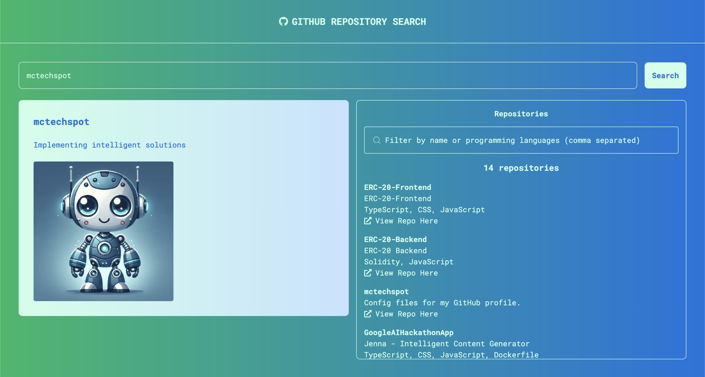

# Github Repository Search App
This repository hosts the source code for a web application that allows users to search for GitHub users and their repositories. The application is built with Next.js - a full stack React framework with TypeScript on the frontend and Node.js on the backend. The backend utilises the GitHub v4 API which implements GraphQL in order to fetch users and their repositories by username.



## Instructions to Run the Application Locally
- Ensure that [Git](https://git-scm.com/downloads) is installed on your device.
- Ensure that [Node](https://nodejs.org/en) is installed on your device.
- Install an IDE on your device. [Visual Studio Code](https://code.visualstudio.com/) is recommended. 
- Generate a [Gitub Personal Access Token](https://docs.github.com/en/authentication/keeping-your-account-and-data-secure/managing-your-personal-access-tokens)
- Launch the IDE and open a safe folder to store the repository codebase.
- Open the terminal and clone the repository with the command
```git clone  https://github.com/mctechspot/GithubRepositorySearchApp```
- Enter the app directory with the following command: 
    ```cd github_repo_search_app```
- Create a file called .env and add a variable named GITHUB_PERSONAL_ACCESS_TOKEN. Copy and paste the value of the GitHub personal access token you created earlier. Look at the .env.example file to guide you with this step.
- Install all dependencies with the command ```npm install```
- Run the application with the command ```npm run dev```

## View Live Application
This application was deployed with [Vercel](https://vercel.com). View it [here](https://github-repository-search-app-beryl.vercel.app).